Mini Data-Analysis Deliverable 1
================

# Welcome to your (maybe) first-ever data analysis project!

And hopefully the first of many. Let’s get started:

1.  Install the [`datateachr`](https://github.com/UBC-MDS/datateachr)
    package by typing the following into your **R terminal**:

<!-- -->

    install.packages("devtools")
    devtools::install_github("UBC-MDS/datateachr")

2.  Load the packages below.

``` r
library(datateachr)
library(tidyverse)
```

    ## ── Attaching packages ─────────────────────────────────────── tidyverse 1.3.2 ──
    ## ✔ ggplot2 3.3.6      ✔ purrr   0.3.4 
    ## ✔ tibble  3.1.8      ✔ dplyr   1.0.10
    ## ✔ tidyr   1.2.0      ✔ stringr 1.4.1 
    ## ✔ readr   2.1.2      ✔ forcats 0.5.2 
    ## ── Conflicts ────────────────────────────────────────── tidyverse_conflicts() ──
    ## ✖ dplyr::filter() masks stats::filter()
    ## ✖ dplyr::lag()    masks stats::lag()

3.  Make a repository in the <https://github.com/stat545ubc-2022>
    Organization. You will be working with this repository for the
    entire data analysis project. You can either make it public, or make
    it private and add the TA’s and Lucy as collaborators. A link to
    help you create a private repository is available on the
    \#collaborative-project Slack channel.

# Instructions

## For Both Milestones

- Each milestone is worth 45 points. The number of points allocated to
  each task will be annotated within each deliverable. Tasks that are
  more challenging will often be allocated more points.

- 10 points will be allocated to the reproducibility, cleanliness, and
  coherence of the overall analysis. While the two milestones will be
  submitted as independent deliverables, the analysis itself is a
  continuum - think of it as two chapters to a story. Each chapter, or
  in this case, portion of your analysis, should be easily followed
  through by someone unfamiliar with the content.
  [Here](https://swcarpentry.github.io/r-novice-inflammation/06-best-practices-R/)
  is a good resource for what constitutes “good code”. Learning good
  coding practices early in your career will save you hassle later on!

## For Milestone 1

**To complete this milestone**, edit [this very `.Rmd`
file](https://raw.githubusercontent.com/UBC-STAT/stat545.stat.ubc.ca/master/content/mini-project/mini-project-1.Rmd)
directly. Fill in the sections that are tagged with
`<!--- start your work below --->`.

**To submit this milestone**, make sure to knit this `.Rmd` file to an
`.md` file by changing the YAML output settings from
`output: html_document` to `output: github_document`. Commit and push
all of your work to the mini-analysis GitHub repository you made
earlier, and tag a release on GitHub. Then, submit a link to your tagged
release on canvas.

**Points**: This milestone is worth 45 points: 43 for your analysis, 1
point for having your Milestone 1 document knit error-free, and 1 point
for tagging your release on Github.

# Learning Objectives

By the end of this milestone, you should:

- Become familiar with your dataset of choosing
- Select 4 questions that you would like to answer with your data
- Generate a reproducible and clear report using R Markdown
- Become familiar with manipulating and summarizing your data in tibbles
  using `dplyr`, with a research question in mind.

# Task 1: Choose your favorite dataset (10 points)

The `datateachr` package by Hayley Boyce and Jordan Bourak currently
composed of 7 semi-tidy datasets for educational purposes. Here is a
brief description of each dataset:

- *apt_buildings*: Acquired courtesy of The City of Toronto’s Open Data
  Portal. It currently has 3455 rows and 37 columns.

- *building_permits*: Acquired courtesy of The City of Vancouver’s Open
  Data Portal. It currently has 20680 rows and 14 columns.

- *cancer_sample*: Acquired courtesy of UCI Machine Learning Repository.
  It currently has 569 rows and 32 columns.

- *flow_sample*: Acquired courtesy of The Government of Canada’s
  Historical Hydrometric Database. It currently has 218 rows and 7
  columns.

- *parking_meters*: Acquired courtesy of The City of Vancouver’s Open
  Data Portal. It currently has 10032 rows and 22 columns.

- *steam_games*: Acquired courtesy of Kaggle. It currently has 40833
  rows and 21 columns.

- *vancouver_trees*: Acquired courtesy of The City of Vancouver’s Open
  Data Portal. It currently has 146611 rows and 20 columns.

**Things to keep in mind**

- We hope that this project will serve as practice for carrying our your
  own *independent* data analysis. Remember to comment your code, be
  explicit about what you are doing, and write notes in this markdown
  document when you feel that context is required. As you advance in the
  project, prompts and hints to do this will be diminished - it’ll be up
  to you!

- Before choosing a dataset, you should always keep in mind **your
  goal**, or in other ways, *what you wish to achieve with this data*.
  This mini data-analysis project focuses on *data wrangling*,
  *tidying*, and *visualization*. In short, it’s a way for you to get
  your feet wet with exploring data on your own.

And that is exactly the first thing that you will do!

1.1 Out of the 7 datasets available in the `datateachr` package, choose
**4** that appeal to you based on their description. Write your choices
below:

**Note**: We encourage you to use the ones in the `datateachr` package,
but if you have a dataset that you’d really like to use, you can include
it here. But, please check with a member of the teaching team to see
whether the dataset is of appropriate complexity. Also, include a
**brief** description of the dataset here to help the teaching team
understand your data.

<!-------------------------- Start your work below ---------------------------->

1: apt_buildings  
2: building_permits  
3: cancer_sample  
4: parking_meters  

<!----------------------------------------------------------------------------->

1.2 One way to narrowing down your selection is to *explore* the
datasets. Use your knowledge of dplyr to find out at least *3*
attributes about each of these datasets (an attribute is something such
as number of rows, variables, class type…). The goal here is to have an
idea of *what the data looks like*.

*Hint:* This is one of those times when you should think about the
cleanliness of your analysis. I added a single code chunk for you below,
but do you want to use more than one? Would you like to write more
comments outside of the code chunk?

<!-------------------------- Start your work below ---------------------------->

``` r
glimpse(apt_buildings)
```

    ## Rows: 3,455
    ## Columns: 37
    ## $ id                               <dbl> 10359, 10360, 10361, 10362, 10363, 10…
    ## $ air_conditioning                 <chr> "NONE", "NONE", "NONE", "NONE", "NONE…
    ## $ amenities                        <chr> "Outdoor rec facilities", "Outdoor po…
    ## $ balconies                        <chr> "YES", "YES", "YES", "YES", "NO", "NO…
    ## $ barrier_free_accessibilty_entr   <chr> "YES", "NO", "NO", "YES", "NO", "NO",…
    ## $ bike_parking                     <chr> "0 indoor parking spots and 10 outdoo…
    ## $ exterior_fire_escape             <chr> "NO", "NO", "NO", "YES", "NO", NA, "N…
    ## $ fire_alarm                       <chr> "YES", "YES", "YES", "YES", "YES", "Y…
    ## $ garbage_chutes                   <chr> "YES", "YES", "NO", "NO", "NO", "NO",…
    ## $ heating_type                     <chr> "HOT WATER", "HOT WATER", "HOT WATER"…
    ## $ intercom                         <chr> "YES", "YES", "YES", "YES", "YES", "Y…
    ## $ laundry_room                     <chr> "YES", "YES", "YES", "YES", "YES", "Y…
    ## $ locker_or_storage_room           <chr> "NO", "YES", "YES", "YES", "NO", "YES…
    ## $ no_of_elevators                  <dbl> 3, 3, 0, 1, 0, 0, 0, 2, 4, 2, 0, 2, 2…
    ## $ parking_type                     <chr> "Underground Garage , Garage accessib…
    ## $ pets_allowed                     <chr> "YES", "YES", "YES", "YES", "YES", "Y…
    ## $ prop_management_company_name     <chr> NA, "SCHICKEDANZ BROS. PROPERTIES", N…
    ## $ property_type                    <chr> "PRIVATE", "PRIVATE", "PRIVATE", "PRI…
    ## $ rsn                              <dbl> 4154812, 4154815, 4155295, 4155309, 4…
    ## $ separate_gas_meters              <chr> "NO", "NO", "NO", "NO", "NO", "NO", "…
    ## $ separate_hydro_meters            <chr> "YES", "YES", "YES", "YES", "YES", "Y…
    ## $ separate_water_meters            <chr> "NO", "NO", "NO", "NO", "NO", "NO", "…
    ## $ site_address                     <chr> "65  FOREST MANOR RD", "70  CLIPPER R…
    ## $ sprinkler_system                 <chr> "YES", "YES", "NO", "YES", "NO", "NO"…
    ## $ visitor_parking                  <chr> "PAID", "FREE", "UNAVAILABLE", "UNAVA…
    ## $ ward                             <chr> "17", "17", "03", "03", "02", "02", "…
    ## $ window_type                      <chr> "DOUBLE PANE", "DOUBLE PANE", "DOUBLE…
    ## $ year_built                       <dbl> 1967, 1970, 1927, 1959, 1943, 1952, 1…
    ## $ year_registered                  <dbl> 2017, 2017, 2017, 2017, 2017, NA, 201…
    ## $ no_of_storeys                    <dbl> 17, 14, 4, 5, 4, 4, 4, 7, 32, 4, 4, 7…
    ## $ emergency_power                  <chr> "NO", "YES", "NO", "NO", "NO", "NO", …
    ## $ `non-smoking_building`           <chr> "YES", "NO", "YES", "YES", "YES", "NO…
    ## $ no_of_units                      <dbl> 218, 206, 34, 42, 25, 34, 14, 105, 57…
    ## $ no_of_accessible_parking_spaces  <dbl> 8, 10, 20, 42, 12, 0, 5, 1, 1, 6, 12,…
    ## $ facilities_available             <chr> "Recycling bins", "Green Bin / Organi…
    ## $ cooling_room                     <chr> "NO", "NO", "NO", "NO", "NO", "NO", "…
    ## $ no_barrier_free_accessible_units <dbl> 2, 0, 0, 42, 0, NA, 14, 0, 0, 1, 25, …

There are 3,455 rows and 37 columns in the apt_buildings dataset. The
columns are of character and double type.

``` r
glimpse(building_permits)
```

    ## Rows: 20,680
    ## Columns: 14
    ## $ permit_number               <chr> "BP-2016-02248", "BU468090", "DB-2016-0445…
    ## $ issue_date                  <date> 2017-02-01, 2017-02-01, 2017-02-01, 2017-…
    ## $ project_value               <dbl> 0, 0, 35000, 15000, 181178, 0, 15000, 0, 6…
    ## $ type_of_work                <chr> "Salvage and Abatement", "New Building", "…
    ## $ address                     <chr> "4378 W 9TH AVENUE, Vancouver, BC V6R 2C7"…
    ## $ project_description         <chr> NA, NA, NA, NA, NA, NA, NA, NA, NA, NA, NA…
    ## $ building_contractor         <chr> NA, NA, NA, "Mercury Contracting Ltd", "08…
    ## $ building_contractor_address <chr> NA, NA, NA, "88 W PENDER ST  \r\nUnit 2069…
    ## $ applicant                   <chr> "Raffaele & Associates DBA: Raffaele and A…
    ## $ applicant_address           <chr> "2642 East Hastings\r\nVancouver, BC  V5K …
    ## $ property_use                <chr> "Dwelling Uses", "Dwelling Uses", "Dwellin…
    ## $ specific_use_category       <chr> "One-Family Dwelling", "Multiple Dwelling"…
    ## $ year                        <dbl> 2017, 2017, 2017, 2017, 2017, 2017, 2017, …
    ## $ bi_id                       <dbl> 524, 535, 539, 541, 543, 546, 547, 548, 54…

There are 20,680 rows and 14 columns in the building_permits dataset.
The columns are of date, character, and double type.

``` r
glimpse(cancer_sample)
```

    ## Rows: 569
    ## Columns: 32
    ## $ ID                      <dbl> 842302, 842517, 84300903, 84348301, 84358402, …
    ## $ diagnosis               <chr> "M", "M", "M", "M", "M", "M", "M", "M", "M", "…
    ## $ radius_mean             <dbl> 17.990, 20.570, 19.690, 11.420, 20.290, 12.450…
    ## $ texture_mean            <dbl> 10.38, 17.77, 21.25, 20.38, 14.34, 15.70, 19.9…
    ## $ perimeter_mean          <dbl> 122.80, 132.90, 130.00, 77.58, 135.10, 82.57, …
    ## $ area_mean               <dbl> 1001.0, 1326.0, 1203.0, 386.1, 1297.0, 477.1, …
    ## $ smoothness_mean         <dbl> 0.11840, 0.08474, 0.10960, 0.14250, 0.10030, 0…
    ## $ compactness_mean        <dbl> 0.27760, 0.07864, 0.15990, 0.28390, 0.13280, 0…
    ## $ concavity_mean          <dbl> 0.30010, 0.08690, 0.19740, 0.24140, 0.19800, 0…
    ## $ concave_points_mean     <dbl> 0.14710, 0.07017, 0.12790, 0.10520, 0.10430, 0…
    ## $ symmetry_mean           <dbl> 0.2419, 0.1812, 0.2069, 0.2597, 0.1809, 0.2087…
    ## $ fractal_dimension_mean  <dbl> 0.07871, 0.05667, 0.05999, 0.09744, 0.05883, 0…
    ## $ radius_se               <dbl> 1.0950, 0.5435, 0.7456, 0.4956, 0.7572, 0.3345…
    ## $ texture_se              <dbl> 0.9053, 0.7339, 0.7869, 1.1560, 0.7813, 0.8902…
    ## $ perimeter_se            <dbl> 8.589, 3.398, 4.585, 3.445, 5.438, 2.217, 3.18…
    ## $ area_se                 <dbl> 153.40, 74.08, 94.03, 27.23, 94.44, 27.19, 53.…
    ## $ smoothness_se           <dbl> 0.006399, 0.005225, 0.006150, 0.009110, 0.0114…
    ## $ compactness_se          <dbl> 0.049040, 0.013080, 0.040060, 0.074580, 0.0246…
    ## $ concavity_se            <dbl> 0.05373, 0.01860, 0.03832, 0.05661, 0.05688, 0…
    ## $ concave_points_se       <dbl> 0.015870, 0.013400, 0.020580, 0.018670, 0.0188…
    ## $ symmetry_se             <dbl> 0.03003, 0.01389, 0.02250, 0.05963, 0.01756, 0…
    ## $ fractal_dimension_se    <dbl> 0.006193, 0.003532, 0.004571, 0.009208, 0.0051…
    ## $ radius_worst            <dbl> 25.38, 24.99, 23.57, 14.91, 22.54, 15.47, 22.8…
    ## $ texture_worst           <dbl> 17.33, 23.41, 25.53, 26.50, 16.67, 23.75, 27.6…
    ## $ perimeter_worst         <dbl> 184.60, 158.80, 152.50, 98.87, 152.20, 103.40,…
    ## $ area_worst              <dbl> 2019.0, 1956.0, 1709.0, 567.7, 1575.0, 741.6, …
    ## $ smoothness_worst        <dbl> 0.1622, 0.1238, 0.1444, 0.2098, 0.1374, 0.1791…
    ## $ compactness_worst       <dbl> 0.6656, 0.1866, 0.4245, 0.8663, 0.2050, 0.5249…
    ## $ concavity_worst         <dbl> 0.71190, 0.24160, 0.45040, 0.68690, 0.40000, 0…
    ## $ concave_points_worst    <dbl> 0.26540, 0.18600, 0.24300, 0.25750, 0.16250, 0…
    ## $ symmetry_worst          <dbl> 0.4601, 0.2750, 0.3613, 0.6638, 0.2364, 0.3985…
    ## $ fractal_dimension_worst <dbl> 0.11890, 0.08902, 0.08758, 0.17300, 0.07678, 0…

There are 569 rows and 32 columns in the cancer_sample dataset. The
columns are of double type.

``` r
glimpse(parking_meters)
```

    ## Rows: 10,032
    ## Columns: 22
    ## $ meter_head     <chr> "Twin", "Pay Station", "Twin", "Single", "Twin", "Twin"…
    ## $ r_mf_9a_6p     <chr> "$2.00", "$1.00", "$1.00", "$1.00", "$2.00", "$2.00", "…
    ## $ r_mf_6p_10     <chr> "$4.00", "$1.00", "$1.00", "$1.00", "$1.00", "$1.00", "…
    ## $ r_sa_9a_6p     <chr> "$2.00", "$1.00", "$1.00", "$1.00", "$2.00", "$2.00", "…
    ## $ r_sa_6p_10     <chr> "$4.00", "$1.00", "$1.00", "$1.00", "$1.00", "$1.00", "…
    ## $ r_su_9a_6p     <chr> "$2.00", "$1.00", "$1.00", "$1.00", "$2.00", "$2.00", "…
    ## $ r_su_6p_10     <chr> "$4.00", "$1.00", "$1.00", "$1.00", "$1.00", "$1.00", "…
    ## $ rate_misc      <chr> NA, "$ .50", NA, NA, NA, NA, NA, NA, NA, NA, NA, NA, NA…
    ## $ time_in_effect <chr> "METER IN EFFECT: 9:00 AM TO 10:00 PM", "METER IN EFFEC…
    ## $ t_mf_9a_6p     <chr> "2 Hr", "10 Hrs", "2 Hr", "2 Hr", "2 Hr", "3 Hr", "2 Hr…
    ## $ t_mf_6p_10     <chr> "4 Hr", "10 Hrs", "4 Hr", "4 Hr", "4 Hr", "4 Hr", "4 Hr…
    ## $ t_sa_9a_6p     <chr> "2 Hr", "10 Hrs", "2 Hr", "2 Hr", "2 Hr", "3 Hr", "2 Hr…
    ## $ t_sa_6p_10     <chr> "4 Hr", "10 Hrs", "4 Hr", "4 Hr", "4 Hr", "4 Hr", "4 Hr…
    ## $ t_su_9a_6p     <chr> "2 Hr", "10 Hrs", "2 Hr", "2 Hr", "2 Hr", "3 Hr", "2 Hr…
    ## $ t_su_6p_10     <chr> "4 Hr", "10 Hrs", "4 Hr", "4 Hr", "4 Hr", "4 Hr", "4 Hr…
    ## $ time_misc      <chr> NA, "No Time Limit", NA, NA, NA, NA, NA, NA, NA, NA, NA…
    ## $ credit_card    <chr> "No", "Yes", "No", "No", "No", "No", "No", "No", "No", …
    ## $ pay_phone      <chr> "66890", "59916", "57042", "57159", "51104", "60868", "…
    ## $ longitude      <dbl> -123.1289, -123.0982, -123.1013, -123.1862, -123.1278, …
    ## $ latitude       <dbl> 49.28690, 49.27215, 49.25468, 49.26341, 49.26354, 49.27…
    ## $ geo_local_area <chr> "West End", "Strathcona", "Riley Park", "West Point Gre…
    ## $ meter_id       <chr> "670805", "471405", "C80145", "D03704", "301023", "5913…

There are 10,032 rows and 22 columns in the parking_meters dataset. The
columns are of character and double type.

<!----------------------------------------------------------------------------->

1.3 Now that you’ve explored the 4 datasets that you were initially most
interested in, let’s narrow it down to 2. What lead you to choose these
2? Briefly explain your choices below, and feel free to include any code
in your explanation.

<!-------------------------- Start your work below ---------------------------->

My two choices are the building_permits and cancer_sample datasets. I
chose the building_permits dataset since it had three types of
variables–whereas the other datasets only had one or two–and there was a
good mix of categorical and continuous variables to perform data
analysis on. Some of the other datasets also lacked a variable that
would serve as an interesting response variable. In the case of this
dataset, the best candidate seems to be the project value variable. The
cancer dataset is within a subject matter that generates many
interesting research questions. In the context of this dataset, the
questions surround utilizing the diagnosis variable as the response
variable. Furthermore, it has only continuous variables within the
dataset which can pose interesting challenges during data analysis.

<!----------------------------------------------------------------------------->

1.4 Time for the final decision! Going back to the beginning, it’s
important to have an *end goal* in mind. For example, if I had chosen
the `titanic` dataset for my project, I might’ve wanted to explore the
relationship between survival and other variables. Try to think of 1
research question that you would want to answer with each dataset. Note
them down below, and make your final choice based on what seems more
interesting to you!

<!-------------------------- Start your work below ---------------------------->

Building permit: Which variables cause project value to increase?

Cancer_sample: Which variables have the strongest relationship with
diagnosis?

Cancer_sample will be the dataset I choose.

<!----------------------------------------------------------------------------->

# Important note

Read Tasks 2 and 3 *fully* before starting to complete either of them.
Probably also a good point to grab a coffee to get ready for the fun
part!

This project is semi-guided, but meant to be *independent*. For this
reason, you will complete tasks 2 and 3 below (under the **START HERE**
mark) as if you were writing your own exploratory data analysis report,
and this guidance never existed! Feel free to add a brief introduction
section to your project, format the document with markdown syntax as you
deem appropriate, and structure the analysis as you deem appropriate.
Remember, marks will be awarded for completion of the 4 tasks, but 10
points of the whole project are allocated to a reproducible and clean
analysis. If you feel lost, you can find a sample data analysis
[here](https://www.kaggle.com/headsortails/tidy-titarnic) to have a
better idea. However, bear in mind that it is **just an example** and
you will not be required to have that level of complexity in your
project.

# Task 2: Exploring your dataset (15 points)

If we rewind and go back to the learning objectives, you’ll see that by
the end of this deliverable, you should have formulated *4* research
questions about your data that you may want to answer during your
project. However, it may be handy to do some more exploration on your
dataset of choice before creating these questions - by looking at the
data, you may get more ideas. **Before you start this task, read all
instructions carefully until you reach START HERE under Task 3**.

2.1 Complete *4 out of the following 8 exercises* to dive deeper into
your data. All datasets are different and therefore, not all of these
tasks may make sense for your data - which is why you should only answer
*4*. Use *dplyr* and *ggplot*.

1.  Plot the distribution of a numeric variable.
2.  Create a new variable based on other variables in your data (only if
    it makes sense)
3.  Investigate how many missing values there are per variable. Can you
    find a way to plot this?
4.  Explore the relationship between 2 variables in a plot.
5.  Filter observations in your data according to your own criteria.
    Think of what you’d like to explore - again, if this was the
    `titanic` dataset, I may want to narrow my search down to passengers
    born in a particular year…
6.  Use a boxplot to look at the frequency of different observations
    within a single variable. You can do this for more than one variable
    if you wish!
7.  Make a new tibble with a subset of your data, with variables and
    observations that you are interested in exploring.
8.  Use a density plot to explore any of your variables (that are
    suitable for this type of plot).

2.2 For each of the 4 exercises that you complete, provide a *brief
explanation* of why you chose that exercise in relation to your data (in
other words, why does it make sense to do that?), and sufficient
comments for a reader to understand your reasoning and code.

<!-------------------------- Start your work below ---------------------------->

``` r
library(tidyverse)
```

### Exercise 1

Since we want to find the variables that have the strongest relationship
to diagnosis, I began with the variable that I thought would be cause a
more serious disease. It is intuitive to believe that the larger a
nuclei, the more aggressive it is, and the more malignant it is.
Consequently, it would be reasonable to investigate the distribution of
area in the dataset via a histogram. It’s more useful, however, to
contrast the distributions of nuclei size for each diagnosis type, so
that we may see how different the area_worst variable is for malignant
and benign tumours.

The R code in the following chunk has two different graphs. The first is
the histogram of the largest nuclei size for all observations. The
second shows two separate histograms plotting the same variable.
However, the histogram on the left shows the distribution for only
benign observations and the one on the right shows it for malignant
observations.

``` r
#Create histogram using all observations
cancer_sample %>% ggplot(aes(area_worst)) + geom_histogram() + xlab('Worst (largest) area of nuclei')
```

    ## `stat_bin()` using `bins = 30`. Pick better value with `binwidth`.

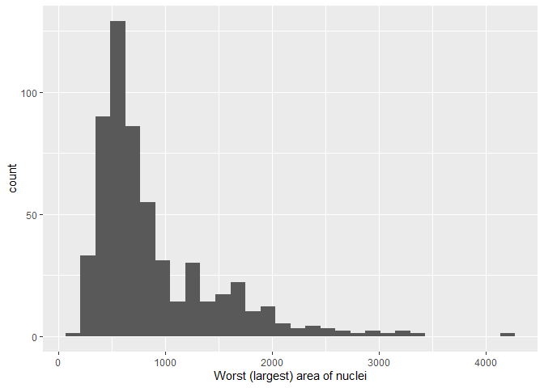<!-- -->

``` r
#Create two histograms separating observations by diagnosis
cancer_sample %>% ggplot(aes(area_worst)) + geom_histogram() + facet_wrap(~diagnosis) + xlab('Worst (largest) area of nuclei')
```

    ## `stat_bin()` using `bins = 30`. Pick better value with `binwidth`.

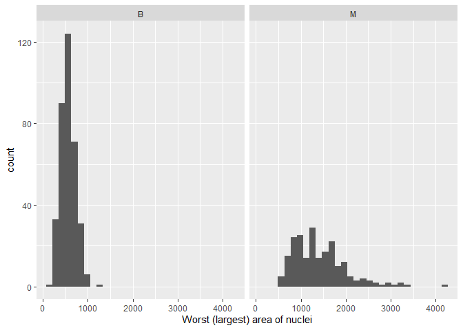<!-- -->

### Exercise 4

The thinking here is connected to the above. If a larger area leads to a
malignant tumour, then other variables, such as the texture of a nuclei,
that have a correlation with area will also be a predictor of
malignancy. In the plot below, the worst radius of a nuclei is graphed
on the x-axis and the average texture of a nuclei is graphed on the
y-axis. Since there are so many observations in close proximity, the
size of the points was decreased so that more of them can be shown. Now,
all we have to do is look at how each variable moves relative to the
other.

``` r
#Exercise 4

#Create a scatterplot of worst radius vs. mean texture

cancer_sample %>% ggplot(aes(area_worst, texture_mean)) + geom_point(size = 0.75)  + xlab('Worst (largest) radius of nuclei') + ylab('Average texture of nuclei')
```

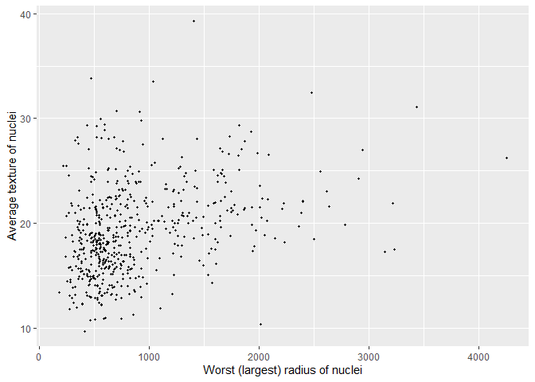<!-- -->

### Exercise 5

The observations are filtered so that only 25% remain. Those with the
largest radius_worst were chosen. From here, we can see if there are
common–and perhaps unusual–characteristics between observations with
large radii. This can help inform our understanding of the dataset and
show the relationships between the variables. Another useful exercise
would be to only include those with the smallest radius_worst, filter
other continuous variables in a similar way, or to filter on a
categorical variable, i.e., by diagnosis type. In the code below,
quantile(cancer_sample\$radius_worst, .75) was the command used to find
the 75th percentile of radius_worst in the dataset. Then, this was used
in conjunction with filter() to get the only the top 25% of observations
for radius_worst.

``` r
#Exercise 5

#Filter observations so that only rows with a worst radius greater than the third quartile are included
cancer_sample %>% filter(radius_worst > quantile(cancer_sample$radius_worst, .75))
```

    ## # A tibble: 142 × 32
    ##          ID diagnosis radius_m…¹ textu…² perim…³ area_…⁴ smoot…⁵ compa…⁶ conca…⁷
    ##       <dbl> <chr>          <dbl>   <dbl>   <dbl>   <dbl>   <dbl>   <dbl>   <dbl>
    ##  1   842302 M               18.0    10.4   123.    1001   0.118   0.278   0.300 
    ##  2   842517 M               20.6    17.8   133.    1326   0.0847  0.0786  0.0869
    ##  3 84300903 M               19.7    21.2   130     1203   0.110   0.160   0.197 
    ##  4 84358402 M               20.3    14.3   135.    1297   0.100   0.133   0.198 
    ##  5   844359 M               18.2    20.0   120.    1040   0.0946  0.109   0.113 
    ##  6   845636 M               16.0    23.2   103.     798.  0.0821  0.0667  0.0330
    ##  7 84610002 M               15.8    17.9   104.     781   0.0971  0.129   0.0995
    ##  8   846226 M               19.2    24.8   132.    1123   0.0974  0.246   0.206 
    ##  9   848406 M               14.7    20.1    94.7    684.  0.0987  0.072   0.0740
    ## 10 84862001 M               16.1    20.7   108.     799.  0.117   0.202   0.172 
    ## # … with 132 more rows, 23 more variables: concave_points_mean <dbl>,
    ## #   symmetry_mean <dbl>, fractal_dimension_mean <dbl>, radius_se <dbl>,
    ## #   texture_se <dbl>, perimeter_se <dbl>, area_se <dbl>, smoothness_se <dbl>,
    ## #   compactness_se <dbl>, concavity_se <dbl>, concave_points_se <dbl>,
    ## #   symmetry_se <dbl>, fractal_dimension_se <dbl>, radius_worst <dbl>,
    ## #   texture_worst <dbl>, perimeter_worst <dbl>, area_worst <dbl>,
    ## #   smoothness_worst <dbl>, compactness_worst <dbl>, concavity_worst <dbl>, …

### Exercise 6

Similar to Exercise 1, the overall distribution of the mean perimeter of
a nuclei was investigated by using a boxplot representing all of the
observations in the cancer_sample dataset. Another graph was created
afterwards that used two boxplots to contrast the observations with a
benign and malignant diagnosis. The reasons for this were two-fold.
First to see if either of the two distributions in the second part were
markedly different from each other and also to see if either were
different from the original boxplot. If the former were true–e.g., the
median perimeter_mean for malignant diagnoses was higher than the median
for benign diagnoses–then we could say that the mean perimeter of a
nuclei was related to diagnosis.

``` r
#Exercise 6

#Create a boxplot using all observations
cancer_sample %>% ggplot(aes(y = perimeter_mean)) + geom_boxplot()  + ylab('Mean perimeter of nuclei')
```

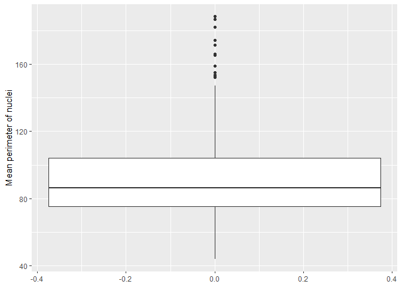<!-- -->

``` r
#Create side-by-side boxplots for benign and malignant observations respectively
cancer_sample %>% ggplot(aes(x = diagnosis, y = perimeter_mean)) + geom_boxplot()  + xlab('Diagnosis') + ylab('Mean perimter of nuclei')
```

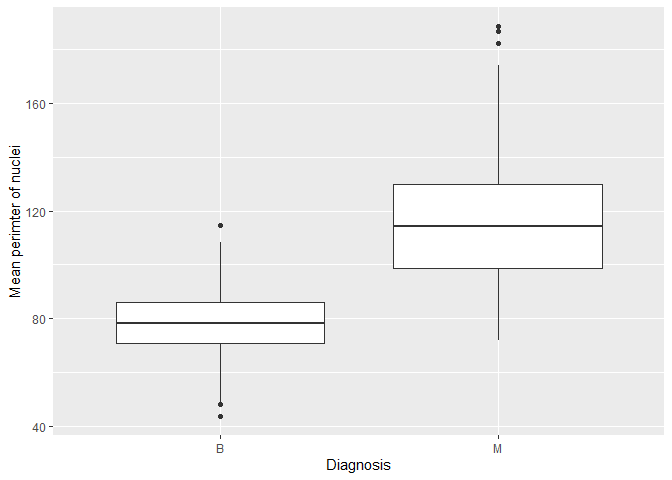<!-- -->

<!----------------------------------------------------------------------------->

# Task 3: Write your research questions (5 points)

So far, you have chosen a dataset and gotten familiar with it through
exploring the data. Now it’s time to figure out 4 research questions
that you would like to answer with your data! Write the 4 questions and
any additional comments at the end of this deliverable. These questions
are not necessarily set in stone - TAs will review them and give you
feedback; therefore, you may choose to pursue them as they are for the
rest of the project, or make modifications!

<!--- *****START HERE***** --->

1.  Which set of variables (i.e., mean or worst) has a stronger
    relationship with diagnosis?

2.  Do the standard error variables provide meaningful information on
    diagnosis type for an observation?

3.  Which measurements (i.e., radius, texture, perimeter, area,
    smoothness, compactness, concavity, concave points, symmetry,
    fractal dimension) are most important when predicting diagnosis and
    which are the least important?

4.  How many of the measurements are correlated with each other? How
    many provide unique information about diagnosis?

# Task 4: Process and summarize your data (13 points)

From Task 2, you should have an idea of the basic structure of your
dataset (e.g. number of rows and columns, class types, etc.). Here, we
will start investigating your data more in-depth using various data
manipulation functions.

### 1.1 (10 points)

Now, for each of your four research questions, choose one task from
options 1-4 (summarizing), and one other task from 4-8 (graphing). You
should have 2 tasks done for each research question (8 total). Make sure
it makes sense to do them! (e.g. don’t use a numerical variables for a
task that needs a categorical variable.). Comment on why each task helps
(or doesn’t!) answer the corresponding research question.

Ensure that the output of each operation is printed!

**Summarizing:**

1.  Compute the *range*, *mean*, and *two other summary statistics* of
    **one numerical variable** across the groups of **one categorical
    variable** from your data.
2.  Compute the number of observations for at least one of your
    categorical variables. Do not use the function `table()`!
3.  Create a categorical variable with 3 or more groups from an existing
    numerical variable. You can use this new variable in the other
    tasks! *An example: age in years into “child, teen, adult, senior”.*
4.  Based on two categorical variables, calculate two summary statistics
    of your choosing.

**Graphing:**

5.  Create a graph out of summarized variables that has at least two
    geom layers.
6.  Create a graph of your choosing, make one of the axes logarithmic,
    and format the axes labels so that they are “pretty” or easier to
    read.
7.  Make a graph where it makes sense to customize the alpha
    transparency.
8.  Create 3 histograms out of summarized variables, with each histogram
    having different sized bins. Pick the “best” one and explain why it
    is the best.

Make sure it’s clear what research question you are doing each operation
for!

<!------------------------- Start your work below ----------------------------->

### Research Question \#1

Which set of variables (i.e., mean or worst) has a stronger relationship
with diagnosis?

Summarizing Exercise 2:

Since Research Question 1 asks whether the ‘mean’ variables or ‘worst’
variables have a stronger relationship to the ‘diagnosis’ variable, more
information is needed on the latter. By totaling the number of benign
and malignant diagnosis, we can begin to get this information. Without
it, a sentence such as “100 malignant observations have a worst radius
greater than 20 whereas almost no benign observations have a worst
radius in this range” is meaningless. We need the context of knowing the
totals. Now that it is known that there are just over 200 malignant
observations, so we can say that 100 observations is about half. But if
there were 400 malignant observations, the original sentence would have
a very different meaning as we tried to answer the research question.

Graphing Exercise 7:

Utilizing density plots and the fill/alpha settings shows us the
distributions for the worst radius of a nuclei and highlights the
difference in the distributions for malignant and benign masses. It is
the tool with which we can say things such as “most malignant
observations have a worst radius greater than twenty and almost no
benign ones do”. By using fill and alpha in a density plot, we can also
see the range of values where both malignant and benign observations are
plentiful, roughly between 15 and 20. If the diagnosis were unknown, one
could make a good guess about its value given the worst radius
measurement from the observation. Thus, this plot begins to answer the
research question since we can conclude that worst radius has a strong
relationship with diagnosis.

``` r
#Summarizing Exercise 2
cancer_sample %>% group_by(Diagnosis = diagnosis) %>% summarise('Number of Observations' = n())
```

    ## # A tibble: 2 × 2
    ##   Diagnosis `Number of Observations`
    ##   <chr>                        <int>
    ## 1 B                              357
    ## 2 M                              212

``` r
#Graphing Exercise 7
cancer_sample %>% ggplot(aes(radius_worst, fill = diagnosis)) + geom_density(alpha = .5) + xlab('Worst (largest) radius of nuclei')
```

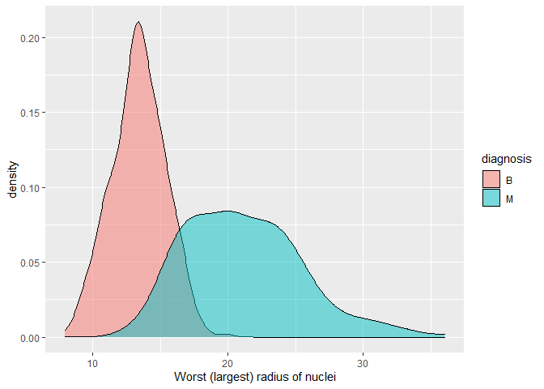<!-- -->

### Research Question \#2

(Two graphing exercises were completed for this question to show a good
variety of techniques taught in this course.)

Do the standard error variables provide meaningful information on
diagnosis type for an observation?

Summarizing Exercise 1:

It is harder to understand the value of the standard deviation variables
when we consider diagnosis as the response variable. While it makes
sense that a malignant mass will have larger nuclei, it is less easy to
form an intuitive understanding of how the standard deviation of nuclei
area should change when we consider only malignant or only benign
masses. By calculating summary statistics, we can begin to create some
idea about what standard deviation variables look like on a basic level.
From there, we can get ideas for what other analysis techniques should
be used to extract as much information as possible out of the standard
deviation variables. Clearly, the summary statistics for area_se are
markedly different for benign and malignant observations which means
that they may provide meaningful info on diagnosis type. Further
investigation is still required but it is helpful as a starting point on
answering the research question.

Graphing Exercise 7:

The purpose of this scatter plot is two-fold: it enables us to see how
the standard deviation of a measurement changes as the measurement
changes, and we can also see the diagnosis for an observation as its
area_sd changes. The outcomes to both are frankly unsurprising, but it
is nice to have them confirmed. It is expected that as measurements
increase (such as the worst area), the standard deviation increases as
well, since SD is not scale invariant. Furthermore, from Exercise 1 in
Task 2, we know that observations with a malignant diagnosis have higher
values of worst areas. So, it is expected that an observation with a
malignant diagnosis will likely have a higher worst area and as such, a
larger area_sd.

This begins to show that SD provides meaningful information on
diagnosis. However, this also begins to answer Research Question \#4, as
it shows that many of the variables are correlated and do not provide
unique information.

Graphing Exercise 8:

The three histograms that were created are as follows: -
compactness_mean with bins = 50 - texture_mean with bins = 25 -
symmetry_mean with bins = 10

The first has too many bins: it is not smooth enough (which means it is
affected by the noise in the data) to create a realistic picture of the
distribution of the variable. The last one has too few bins: it does not
show enough detail to provide any meaningful information on the
distribution of the variable. The second one, with bins = 30, is best.
It strikes a balance between the two aforementioned histograms by
showing a smooth distribution that is not as dependent on the
observations collected in the sample, yet it enables one to see the
specific distribution of the variable.

It would be impossible to determine the usefulness of the standard error
variables without knowing how their values are distributed: we must
first collect the most basic information about them before moving onto
more complex manipulations of the data. These plots have begun providing
this information on some of the standard error variables in the data.

``` r
#Summarizing Exercise 1
cancer_sample %>% group_by(Diagnosis = diagnosis) %>% summarise(min(area_se), max(area_se), mean(area_se), median(area_se), sd(area_se))
```

    ## # A tibble: 2 × 6
    ##   Diagnosis `min(area_se)` `max(area_se)` `mean(area_se)` median(area_…¹ sd(ar…²
    ##   <chr>              <dbl>          <dbl>           <dbl>          <dbl>   <dbl>
    ## 1 B                   6.80           77.1            21.1           19.6    8.84
    ## 2 M                  14.0           542.             72.7           58.5   61.4 
    ## # … with abbreviated variable names ¹​`median(area_se)`, ²​`sd(area_se)`

``` r
#Graphing Exercise 7
cancer_sample %>% ggplot(aes(area_se, area_worst, colour = diagnosis)) + geom_point(alpha = .4) + scale_x_log10('Standard deviation of the area of a nuclei') + ylab('Worst (largest) area of nuclei')
```

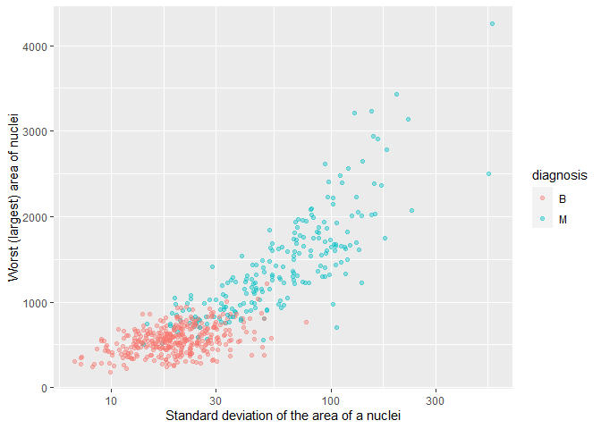<!-- -->

``` r
#Graphing Exercise 8

cancer_sample %>% ggplot() + geom_histogram(aes(compactness_se), bins = 70) + xlab('Standard error of the compactness of nuclei')
```

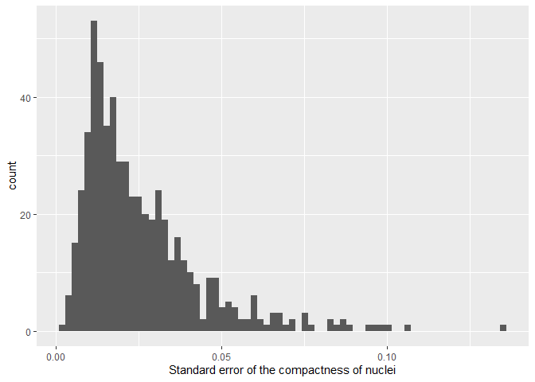<!-- -->

``` r
cancer_sample %>% ggplot() + geom_histogram(aes(texture_se), bins = 30) + xlab('Standard error of the texture of nuclei')
```

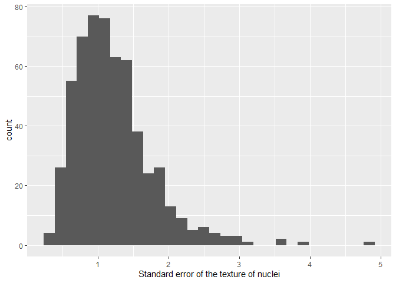<!-- -->

``` r
cancer_sample %>% ggplot() + geom_histogram(aes(symmetry_se), bins = 10) + xlab('Standard error of the symmetry of nuclei')
```

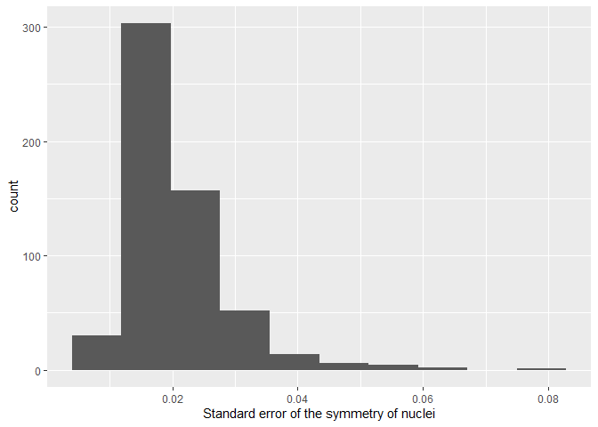<!-- -->

### Research Question \#3

Which measurements (i.e., radius, texture, perimeter, area, smoothness,
compactness, concavity, concave points, symmetry, fractal dimension) are
most important when predicting diagnosis and which are the least
important?

Summarizing Exercise 1:

Measures of spread/central tendency/other summary statistics are
important for determining the best variables for prediction. As an
example consider how we checked the range via min() and max(). Since the
minimum of area_mean for a malignant mass is 361, any value below that
likely belongs to an observation for a benign mass. This exercise shows
that area is probably important for predicting diagnosis.

Graphing Exercise 7:

The jitter plot can show the ‘worst symmetry’ values of the observations
for each diagnosis. If the jitter plot with the alpha setting was not
used, it would simply look like a line instead of clearly showing
distinct values. In this case, we can see that symmetry does not have a
strong relationship with the diagnosis variable since many of the values
are similar for benign and malignant tumours. So we know that symmetry
is not important for predicting diagnosis.

``` r
#Summarizing Exercise 1
cancer_sample %>% group_by(diagnosis) %>% summarise(min(area_mean), max(area_mean), mean(area_mean), median(area_mean), IQR(area_mean))
```

    ## # A tibble: 2 × 6
    ##   diagnosis `min(area_mean)` `max(area_mean)` `mean(area_mean)` median…¹ IQR(a…²
    ##   <chr>                <dbl>            <dbl>             <dbl>    <dbl>   <dbl>
    ## 1 B                     144.             992.              463.     458.    173.
    ## 2 M                     362.            2501               978.     932     498.
    ## # … with abbreviated variable names ¹​`median(area_mean)`, ²​`IQR(area_mean)`

``` r
#Graphing Exercise 7
cancer_sample %>% ggplot(aes(diagnosis, symmetry_worst)) + geom_jitter(alpha = 0.4, width = .15, size = 0.8)
```

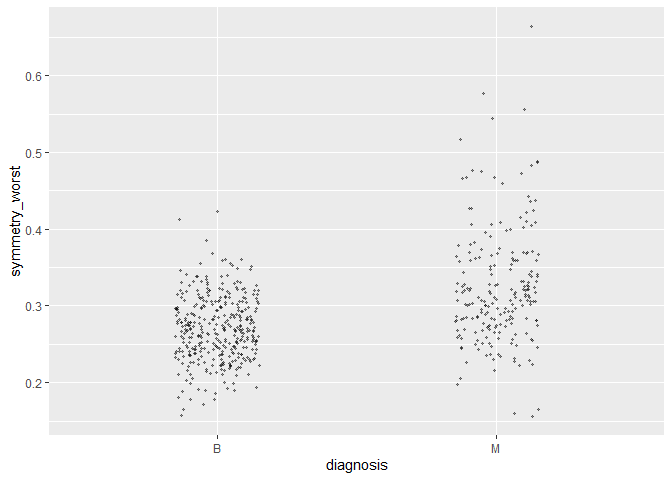<!-- -->

### Research Question \#4

How many of the measurements are correlated with each other? How many
provide unique information about diagnosis?

Summarizing Exercise 3:

By converting a numerical variable to a categorical, we can compute
summary statistics for other continuous variables across the different
categories of the new predictor. Thus, we can compare these variables in
a different way than we could before. The continuous-categorical
comparison may elucidate more–or different–information than if we just
looked at the variables from a continuous-continuous perspective. In
this way, it has helped us begin to answer the question.

For the mean area of a nuclei, it was separated into three categories
(small, medium, or large) using the case_when() function. Any
observations with a mean area in the first quartile were put into
‘small’; those observations with a mean area in the second or third
quartile were placed into ‘medium’; similarly, observations with a
mean_area above the 75th percentile were categorized as ‘large’. The new
variable was called size.

Graphing Exercise 6:

The scatterplot between area_worst and radius_worst clearly shows that
area and worst are highly correlated and provide the same information
about diagnosis. (The logarithmic axis is useful since most observations
have a lower value but the presence of outliers means that some
observations are quite distant in a regular scatterplot. Now, it is a
more even plot.) Despite noise in the data, there is almost a straight
line. Therefore, we have concluded these two have the same information
and we have begun to answer the research question.

To accentuate any relationship between the variables, a line of best fit
was added to the scatterplot using geom_smooth(). Typically, there is a
shaded area on either side represent the 95% confidence interval for the
line. In this case, the relationship between the data is so strong that
one doesn’t appear.

``` r
#Summarizing Exercise 3

cancer_sample2 = cancer_sample %>% mutate(
  
  size = case_when(area_mean <= quantile(cancer_sample$area_mean, .25) ~ 'small', area_mean <= quantile(cancer_sample$area_mean, .75) ~ 'medium', TRUE ~ 'large')
  
) 

head(cancer_sample2)
```

    ## # A tibble: 6 × 33
    ##       ID diagn…¹ radiu…² textu…³ perim…⁴ area_…⁵ smoot…⁶ compa…⁷ conca…⁸ conca…⁹
    ##    <dbl> <chr>     <dbl>   <dbl>   <dbl>   <dbl>   <dbl>   <dbl>   <dbl>   <dbl>
    ## 1 8.42e5 M          18.0    10.4   123.    1001   0.118   0.278   0.300   0.147 
    ## 2 8.43e5 M          20.6    17.8   133.    1326   0.0847  0.0786  0.0869  0.0702
    ## 3 8.43e7 M          19.7    21.2   130     1203   0.110   0.160   0.197   0.128 
    ## 4 8.43e7 M          11.4    20.4    77.6    386.  0.142   0.284   0.241   0.105 
    ## 5 8.44e7 M          20.3    14.3   135.    1297   0.100   0.133   0.198   0.104 
    ## 6 8.44e5 M          12.4    15.7    82.6    477.  0.128   0.17    0.158   0.0809
    ## # … with 23 more variables: symmetry_mean <dbl>, fractal_dimension_mean <dbl>,
    ## #   radius_se <dbl>, texture_se <dbl>, perimeter_se <dbl>, area_se <dbl>,
    ## #   smoothness_se <dbl>, compactness_se <dbl>, concavity_se <dbl>,
    ## #   concave_points_se <dbl>, symmetry_se <dbl>, fractal_dimension_se <dbl>,
    ## #   radius_worst <dbl>, texture_worst <dbl>, perimeter_worst <dbl>,
    ## #   area_worst <dbl>, smoothness_worst <dbl>, compactness_worst <dbl>,
    ## #   concavity_worst <dbl>, concave_points_worst <dbl>, symmetry_worst <dbl>, …

``` r
head(cancer_sample2 %>% select(size))
```

    ## # A tibble: 6 × 1
    ##   size  
    ##   <chr> 
    ## 1 large 
    ## 2 large 
    ## 3 large 
    ## 4 small 
    ## 5 large 
    ## 6 medium

``` r
#Graphing Exercise 5
cancer_sample %>% ggplot(aes(x = area_worst, y = radius_worst)) + geom_point(alpha = 0.2) + geom_smooth(method = "lm") + scale_x_log10('Worst (largest) area of nuclei') + ylab('Worst (largest) radius of nuclei')
```

    ## `geom_smooth()` using formula 'y ~ x'

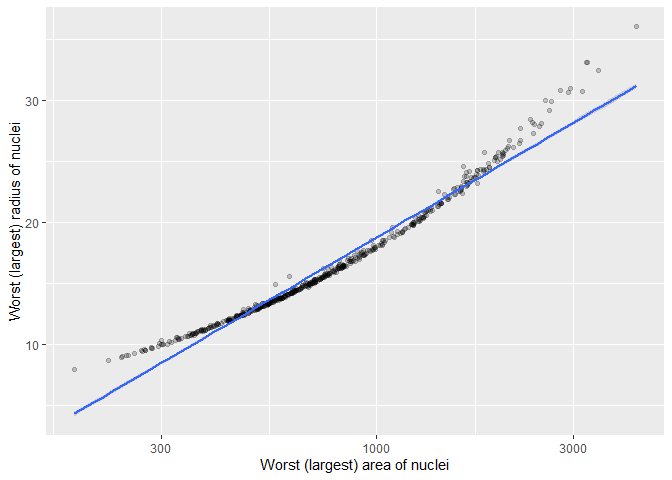<!-- -->

<!----------------------------------------------------------------------------->

### 1.2 (3 points)

Based on the operations that you’ve completed, how much closer are you
to answering your research questions? Think about what aspects of your
research questions remain unclear. Can your research questions be
refined, now that you’ve investigated your data a bit more? Which
research questions are yielding interesting results?

<!-------------------------- Start your work below ---------------------------->

There was progress made in each of the research questions, but it was
clear that there is still quite a lot more to do to answer these
questions. Take Research Question \#4 as an example. It is arguably the
simplest question that was posed, and yet, the analysis above only
compared two of the variables with each other using a single method.
Given the long list (i.e., radius, texture, perimeter, area, smoothness,
compactness, concavity, concave points, symmetry, fractal dimension) and
the fact that more than one method should be used to provide a
guarantee, the scope of the question seems too wide. Consequently, it is
the question that would benefit most from being refined.

Research Question 1 is comparatively narrower in scope. It only requires
that two sets of variables be compared, not each variable within those
sets. Furthermore, the density that was plotted for that question seemed
to indicate that, at the very least, the ‘worst’ variables had a strong
relationship with diagnosis. Research Question 3 was promising as well,
but it may run into a similar problem as Q4 given that it asks about
each type of variable (e.g., area, radius, etc.). Research Question 2
may have some overlap with Question 4. While the SE variables may have
some value with predicting diagnosis, it is clear that they will often
be correlated with other variables that also contain useful information.
So, answering one question will answer the other and much of the work
will overlap. For that reason, it may not be beneficial to continue to
investigate Question 2 as it is now. Although, this does not mean it
should be abandoned completely; it could be refined instead.

<!----------------------------------------------------------------------------->

### Attribution

Thanks to Icíar Fernández Boyano for mostly putting this together, and
Vincenzo Coia for launching.
