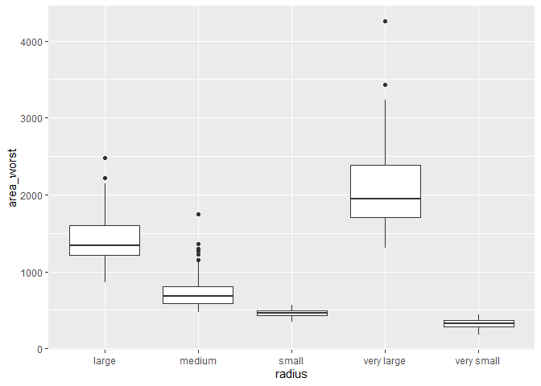
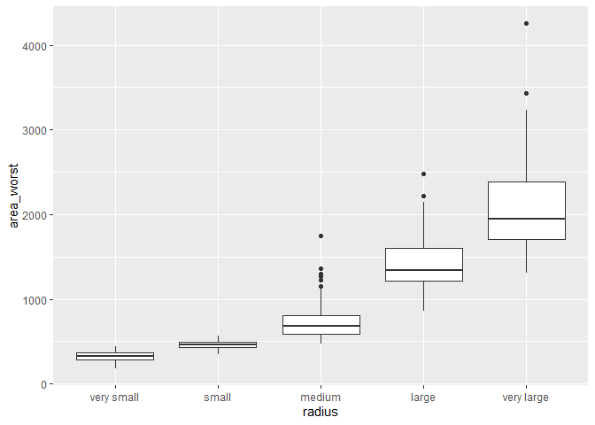

Mini Data Analysis Milestone 2
================

*To complete this milestone, you can edit [this `.rmd`
file](https://raw.githubusercontent.com/UBC-STAT/stat545.stat.ubc.ca/master/content/mini-project/mini-project-2.Rmd)
directly. Fill in the sections that are commented out with
`<!--- start your work here--->`. When you are done, make sure to knit
to an `.md` file by changing the output in the YAML header to
`github_document`, before submitting a tagged release on canvas.*

# Welcome to your second (and last) milestone in your mini data analysis project!

In Milestone 1, you explored your data, came up with research questions,
and obtained some results by making summary tables and graphs. This
time, we will first explore more in depth the concept of *tidy data.*
Then, you’ll be sharpening some of the results you obtained from your
previous milestone by:

- Manipulating special data types in R: factors and/or dates and times.
- Fitting a model object to your data, and extract a result.
- Reading and writing data as separate files.

**NOTE**: The main purpose of the mini data analysis is to integrate
what you learn in class in an analysis. Although each milestone provides
a framework for you to conduct your analysis, it’s possible that you
might find the instructions too rigid for your data set. If this is the
case, you may deviate from the instructions – just make sure you’re
demonstrating a wide range of tools and techniques taught in this class.

# Instructions

**To complete this milestone**, edit [this very `.Rmd`
file](https://raw.githubusercontent.com/UBC-STAT/stat545.stat.ubc.ca/master/content/mini-project/mini-project-2.Rmd)
directly. Fill in the sections that are tagged with
`<!--- start your work here--->`.

**To submit this milestone**, make sure to knit this `.Rmd` file to an
`.md` file by changing the YAML output settings from
`output: html_document` to `output: github_document`. Commit and push
all of your work to your mini-analysis GitHub repository, and tag a
release on GitHub. Then, submit a link to your tagged release on canvas.

**Points**: This milestone is worth 55 points (compared to the 45 points
of the Milestone 1): 45 for your analysis, and 10 for your entire
mini-analysis GitHub repository. Details follow.

**Research Questions**: In Milestone 1, you chose two research questions
to focus on. Wherever realistic, your work in this milestone should
relate to these research questions whenever we ask for justification
behind your work. In the case that some tasks in this milestone don’t
align well with one of your research questions, feel free to discuss
your results in the context of a different research question.

# Learning Objectives

By the end of this milestone, you should:

- Understand what *tidy* data is, and how to create it using `tidyr`.
- Generate a reproducible and clear report using R Markdown.
- Manipulating special data types in R: factors and/or dates and times.
- Fitting a model object to your data, and extract a result.
- Reading and writing data as separate files.

# Setup

Begin by loading your data and the tidyverse package below:

``` r
library(datateachr) # <- might contain the data you picked!
library(tidyverse)
```

# Task 1: Tidy your data (15 points)

In this task, we will do several exercises to reshape our data. The goal
here is to understand how to do this reshaping with the `tidyr` package.

A reminder of the definition of *tidy* data:

- Each row is an **observation**
- Each column is a **variable**
- Each cell is a **value**

*Tidy’ing* data is sometimes necessary because it can simplify
computation. Other times it can be nice to organize data so that it can
be easier to understand when read manually.

### 2.1 (2.5 points)

Based on the definition above, can you identify if your data is tidy or
untidy? Go through all your columns, or if you have \>8 variables, just
pick 8, and explain whether the data is untidy or tidy.

<!--------------------------- Start your work below --------------------------->

The data is tidy. Clearly, ID represents a single observation.
duplicated() returns true if a value is identical to another, earlier
value in the same vector and false if it is a unique value. Since the
sum of duplicate when applied to the ID variable equals zero, we know
that all values are unique. In other words, each row is an observation.

Since the cancer_sample has over 8 variables, I will choose the first 8
after ID, i.e., diagnosis, radius_mean, texture_mean, perimeter_mean,
area_mean, smoothness_mean, compactness_mean, concavity_mean.

Diagnosis shows whether there the mass is malignant or benign. The other
seven observations show the mean for some measurement of the nuclei in
the mass. These are all individual variables. Thus, the second part of
the tidy definition holds.

Lastly, we can easily see that there is only one value in each cell. For
diagnosis, there is either an ‘M’ or ‘B’. For the other seven columns,
there is one number (double), that represents the measurement. This is
the final condition for data to be tidy.

Therefore, this is a tidy dataset.

``` r
#How many duplicates are there in ID?
sum(duplicated(cancer_sample$ID))
```

    ## [1] 0

``` r
#Show the eight columns being investigated
head(cancer_sample[2:9])
```

    ## # A tibble: 6 × 8
    ##   diagnosis radius_mean texture_mean perimeter…¹ area_…² smoot…³ compa…⁴ conca…⁵
    ##   <chr>           <dbl>        <dbl>       <dbl>   <dbl>   <dbl>   <dbl>   <dbl>
    ## 1 M                18.0         10.4       123.    1001   0.118   0.278   0.300 
    ## 2 M                20.6         17.8       133.    1326   0.0847  0.0786  0.0869
    ## 3 M                19.7         21.2       130     1203   0.110   0.160   0.197 
    ## 4 M                11.4         20.4        77.6    386.  0.142   0.284   0.241 
    ## 5 M                20.3         14.3       135.    1297   0.100   0.133   0.198 
    ## 6 M                12.4         15.7        82.6    477.  0.128   0.17    0.158 
    ## # … with abbreviated variable names ¹​perimeter_mean, ²​area_mean,
    ## #   ³​smoothness_mean, ⁴​compactness_mean, ⁵​concavity_mean

``` r
#Show values of diagnosis
unique(cancer_sample$diagnosis)
```

    ## [1] "M" "B"

<!----------------------------------------------------------------------------->

### 2.2 (5 points)

Now, if your data is tidy, untidy it! Then, tidy it back to it’s
original state.

If your data is untidy, then tidy it! Then, untidy it back to it’s
original state.

Be sure to explain your reasoning for this task. Show us the “before”
and “after”.

<!--------------------------- Start your work below --------------------------->

The data becomes untidy by using pivot_wider to put each diagnoses as
their own column. Since M and B are not variables but values of
diagnosis the second condition of tidyness is violated. Furthermore,
there are now NAs in certain cells, so the third condition is violated
as well.

To tidy it back up, pivot_longer is used on the M and B columns while
using values_drop_na = TRUE to ensure that there are no duplicate rows.
Then, select() and everything() is used to reorder the columns to return
it to the initial dataset.

``` r
#Untidy dataset
untidy_cancer_sample = cancer_sample %>% pivot_wider(names_from = diagnosis, values_from = radius_mean)
untidy_cancer_sample
```

    ## # A tibble: 569 × 32
    ##          ID texture_mean perim…¹ area_…² smoot…³ compa…⁴ conca…⁵ conca…⁶ symme…⁷
    ##       <dbl>        <dbl>   <dbl>   <dbl>   <dbl>   <dbl>   <dbl>   <dbl>   <dbl>
    ##  1   842302         10.4   123.    1001   0.118   0.278   0.300   0.147    0.242
    ##  2   842517         17.8   133.    1326   0.0847  0.0786  0.0869  0.0702   0.181
    ##  3 84300903         21.2   130     1203   0.110   0.160   0.197   0.128    0.207
    ##  4 84348301         20.4    77.6    386.  0.142   0.284   0.241   0.105    0.260
    ##  5 84358402         14.3   135.    1297   0.100   0.133   0.198   0.104    0.181
    ##  6   843786         15.7    82.6    477.  0.128   0.17    0.158   0.0809   0.209
    ##  7   844359         20.0   120.    1040   0.0946  0.109   0.113   0.074    0.179
    ##  8 84458202         20.8    90.2    578.  0.119   0.164   0.0937  0.0598   0.220
    ##  9   844981         21.8    87.5    520.  0.127   0.193   0.186   0.0935   0.235
    ## 10 84501001         24.0    84.0    476.  0.119   0.240   0.227   0.0854   0.203
    ## # … with 559 more rows, 23 more variables: fractal_dimension_mean <dbl>,
    ## #   radius_se <dbl>, texture_se <dbl>, perimeter_se <dbl>, area_se <dbl>,
    ## #   smoothness_se <dbl>, compactness_se <dbl>, concavity_se <dbl>,
    ## #   concave_points_se <dbl>, symmetry_se <dbl>, fractal_dimension_se <dbl>,
    ## #   radius_worst <dbl>, texture_worst <dbl>, perimeter_worst <dbl>,
    ## #   area_worst <dbl>, smoothness_worst <dbl>, compactness_worst <dbl>,
    ## #   concavity_worst <dbl>, concave_points_worst <dbl>, symmetry_worst <dbl>, …

``` r
#Tidy dataset
tidy_cancer_sample = untidy_cancer_sample %>% pivot_longer(cols = c(M, B), names_to  = 'diagnosis', values_to = 'radius_mean', values_drop_na = TRUE) %>% select(ID, diagnosis, radius_mean, everything())
tidy_cancer_sample
```

    ## # A tibble: 569 × 32
    ##          ID diagnosis radius_m…¹ textu…² perim…³ area_…⁴ smoot…⁵ compa…⁶ conca…⁷
    ##       <dbl> <chr>          <dbl>   <dbl>   <dbl>   <dbl>   <dbl>   <dbl>   <dbl>
    ##  1   842302 M               18.0    10.4   123.    1001   0.118   0.278   0.300 
    ##  2   842517 M               20.6    17.8   133.    1326   0.0847  0.0786  0.0869
    ##  3 84300903 M               19.7    21.2   130     1203   0.110   0.160   0.197 
    ##  4 84348301 M               11.4    20.4    77.6    386.  0.142   0.284   0.241 
    ##  5 84358402 M               20.3    14.3   135.    1297   0.100   0.133   0.198 
    ##  6   843786 M               12.4    15.7    82.6    477.  0.128   0.17    0.158 
    ##  7   844359 M               18.2    20.0   120.    1040   0.0946  0.109   0.113 
    ##  8 84458202 M               13.7    20.8    90.2    578.  0.119   0.164   0.0937
    ##  9   844981 M               13      21.8    87.5    520.  0.127   0.193   0.186 
    ## 10 84501001 M               12.5    24.0    84.0    476.  0.119   0.240   0.227 
    ## # … with 559 more rows, 23 more variables: concave_points_mean <dbl>,
    ## #   symmetry_mean <dbl>, fractal_dimension_mean <dbl>, radius_se <dbl>,
    ## #   texture_se <dbl>, perimeter_se <dbl>, area_se <dbl>, smoothness_se <dbl>,
    ## #   compactness_se <dbl>, concavity_se <dbl>, concave_points_se <dbl>,
    ## #   symmetry_se <dbl>, fractal_dimension_se <dbl>, radius_worst <dbl>,
    ## #   texture_worst <dbl>, perimeter_worst <dbl>, area_worst <dbl>,
    ## #   smoothness_worst <dbl>, compactness_worst <dbl>, concavity_worst <dbl>, …

``` r
#Are the tidied dataset and the original dataset the same?
sum(tidy_cancer_sample != cancer_sample)
```

    ## [1] 0

<!----------------------------------------------------------------------------->

### 2.3 (7.5 points)

Now, you should be more familiar with your data, and also have made
progress in answering your research questions. Based on your interest,
and your analyses, pick 2 of the 4 research questions to continue your
analysis in the next four tasks:

<!-------------------------- Start your work below ---------------------------->

1.  Which set of variables (i.e., mean or worst) has a stronger
    relationship with diagnosis?

2.  Which measurements (i.e., radius, texture, perimeter, area,
    smoothness, compactness, concavity, concave points, symmetry,
    fractal dimension) are most important when predicting diagnosis and
    which are the least important?

<!----------------------------------------------------------------------------->

Explain your decision for choosing the above two research questions.

<!--------------------------- Start your work below --------------------------->

In the last milestone, these were my four questions:

1.  Which set of variables (i.e., mean or worst) has a stronger
    relationship with diagnosis?
2.  Do the standard error variables provide meaningful information on
    diagnosis type for an observation?
3.  Which measurements (i.e., radius, texture, perimeter, area,
    smoothness, compactness, concavity, concave points, symmetry,
    fractal dimension) are most important when predicting diagnosis and
    which are the least important?
4.  How many of the measurements are correlated with each other? How
    many provide unique information about diagnosis?

I have chosen iii. and iv. to continue over the next four tasks.

REASONING FOR QUESTION II:

After the preliminary investigation, I found that Question 2 and 4 were
not ideal. I decided that checking each measurement between each other
may be beyond the scope of these exercises. Instead of investigating
each to answer the research question, now it is just sufficient to
identify as many as possible that are correlated. There are over 30
variables in the dataset. By identifying which are correlated with each
other, we can decrease the number of columns without losing any
information. A lower number of variables will make analysis easier to
perform while creating output that is more understandable and intuitive.
If we don’t do this, the dataset will be needlessly complex.

REASONING FOR QUESTION III:

One of the most important tasks when using medical data is to predict
diagnosis. Also, there is no other clear response variable in the data,
so it makes sense to use the other measurements to predict whether the
mass is malignant or benign.

<!----------------------------------------------------------------------------->

Now, try to choose a version of your data that you think will be
appropriate to answer these 2 questions. Use between 4 and 8 functions
that we’ve covered so far (i.e. by filtering, cleaning, tidy’ing,
dropping irrelevant columns, etc.).

<!--------------------------- Start your work below --------------------------->

Question 1:

– Function 1 & 2: Use select() and ends_with() to drop irrelevant
columns. Now, the dataset has diagnosis and only worst variables or only
mean variables which are the most relevant to the first question.

``` r
#Create dataset with diagnosis and mean variables
cancer_sample_mean = cancer_sample %>% select(diagnosis, ends_with("mean"))
head(cancer_sample_mean)
```

    ## # A tibble: 6 × 11
    ##   diagnosis radius_mean textur…¹ perim…² area_…³ smoot…⁴ compa…⁵ conca…⁶ conca…⁷
    ##   <chr>           <dbl>    <dbl>   <dbl>   <dbl>   <dbl>   <dbl>   <dbl>   <dbl>
    ## 1 M                18.0     10.4   123.    1001   0.118   0.278   0.300   0.147 
    ## 2 M                20.6     17.8   133.    1326   0.0847  0.0786  0.0869  0.0702
    ## 3 M                19.7     21.2   130     1203   0.110   0.160   0.197   0.128 
    ## 4 M                11.4     20.4    77.6    386.  0.142   0.284   0.241   0.105 
    ## 5 M                20.3     14.3   135.    1297   0.100   0.133   0.198   0.104 
    ## 6 M                12.4     15.7    82.6    477.  0.128   0.17    0.158   0.0809
    ## # … with 2 more variables: symmetry_mean <dbl>, fractal_dimension_mean <dbl>,
    ## #   and abbreviated variable names ¹​texture_mean, ²​perimeter_mean, ³​area_mean,
    ## #   ⁴​smoothness_mean, ⁵​compactness_mean, ⁶​concavity_mean, ⁷​concave_points_mean

``` r
#Create dataset with diagnosis and worst variables
cancer_sample_worst = cancer_sample %>% select(diagnosis, ends_with("worst"))
head(cancer_sample_worst)
```

    ## # A tibble: 6 × 11
    ##   diagnosis radius_worst textu…¹ perim…² area_…³ smoot…⁴ compa…⁵ conca…⁶ conca…⁷
    ##   <chr>            <dbl>   <dbl>   <dbl>   <dbl>   <dbl>   <dbl>   <dbl>   <dbl>
    ## 1 M                 25.4    17.3   185.    2019    0.162   0.666   0.712   0.265
    ## 2 M                 25.0    23.4   159.    1956    0.124   0.187   0.242   0.186
    ## 3 M                 23.6    25.5   152.    1709    0.144   0.424   0.450   0.243
    ## 4 M                 14.9    26.5    98.9    568.   0.210   0.866   0.687   0.258
    ## 5 M                 22.5    16.7   152.    1575    0.137   0.205   0.4     0.162
    ## 6 M                 15.5    23.8   103.     742.   0.179   0.525   0.536   0.174
    ## # … with 2 more variables: symmetry_worst <dbl>, fractal_dimension_worst <dbl>,
    ## #   and abbreviated variable names ¹​texture_worst, ²​perimeter_worst,
    ## #   ³​area_worst, ⁴​smoothness_worst, ⁵​compactness_worst, ⁶​concavity_worst,
    ## #   ⁷​concave_points_worst

– Function 3, 4, 5: group_by, summarise, across. It summarizes the
datasets by diagnosis created in the last code chunk. This will allow
for easier comparison between the mean and worst groups.

``` r
cancer_sample_mean_summary = cancer_sample_mean %>% 
  group_by(diagnosis) %>% 
  summarise(across(where(is.numeric), mean))
head(cancer_sample_mean_summary)
```

    ## # A tibble: 2 × 11
    ##   diagnosis radius_mean textur…¹ perim…² area_…³ smoot…⁴ compa…⁵ conca…⁶ conca…⁷
    ##   <chr>           <dbl>    <dbl>   <dbl>   <dbl>   <dbl>   <dbl>   <dbl>   <dbl>
    ## 1 B                12.1     17.9    78.1    463.  0.0925  0.0801  0.0461  0.0257
    ## 2 M                17.5     21.6   115.     978.  0.103   0.145   0.161   0.0880
    ## # … with 2 more variables: symmetry_mean <dbl>, fractal_dimension_mean <dbl>,
    ## #   and abbreviated variable names ¹​texture_mean, ²​perimeter_mean, ³​area_mean,
    ## #   ⁴​smoothness_mean, ⁵​compactness_mean, ⁶​concavity_mean, ⁷​concave_points_mean

``` r
cancer_sample_worst_summary = cancer_sample_worst %>% 
  group_by(diagnosis) %>% 
  summarise(across(where(is.numeric), mean))
head(cancer_sample_mean_summary)
```

    ## # A tibble: 2 × 11
    ##   diagnosis radius_mean textur…¹ perim…² area_…³ smoot…⁴ compa…⁵ conca…⁶ conca…⁷
    ##   <chr>           <dbl>    <dbl>   <dbl>   <dbl>   <dbl>   <dbl>   <dbl>   <dbl>
    ## 1 B                12.1     17.9    78.1    463.  0.0925  0.0801  0.0461  0.0257
    ## 2 M                17.5     21.6   115.     978.  0.103   0.145   0.161   0.0880
    ## # … with 2 more variables: symmetry_mean <dbl>, fractal_dimension_mean <dbl>,
    ## #   and abbreviated variable names ¹​texture_mean, ²​perimeter_mean, ³​area_mean,
    ## #   ⁴​smoothness_mean, ⁵​compactness_mean, ⁶​concavity_mean, ⁷​concave_points_mean

QUESTION 2:

– Function 6, 7: mutate, case_when.

Many of the exercises in the next section require a categorical
variable. Since the cancer_sample dataset only has one–diagnosis, which
is being treated as the response variable–it is beneficial to create
another. This will enable more analysis. Radius is split up using the
quantile() function to find the 25th and 75th percentile. Then,
observations are categorized into small, medium, and large by their
radius length.

``` r
#Mutate another categorical variable with three different 
cancer_sample_new = cancer_sample %>% mutate(
  
  radius = as.factor(case_when(radius_mean <= quantile(cancer_sample$radius_mean, .1) ~ 'very small', 
                     radius_mean <= quantile(cancer_sample$radius_mean, .25) ~ 'small',
                     radius_mean <= quantile(cancer_sample$radius_mean, .75) ~ 'medium',
                     radius_mean <= quantile(cancer_sample$radius_mean, .9) ~ 'large',
                     TRUE ~ 'very large'))
  
)

head(cancer_sample_new)
```

    ## # A tibble: 6 × 33
    ##       ID diagn…¹ radiu…² textu…³ perim…⁴ area_…⁵ smoot…⁶ compa…⁷ conca…⁸ conca…⁹
    ##    <dbl> <chr>     <dbl>   <dbl>   <dbl>   <dbl>   <dbl>   <dbl>   <dbl>   <dbl>
    ## 1 8.42e5 M          18.0    10.4   123.    1001   0.118   0.278   0.300   0.147 
    ## 2 8.43e5 M          20.6    17.8   133.    1326   0.0847  0.0786  0.0869  0.0702
    ## 3 8.43e7 M          19.7    21.2   130     1203   0.110   0.160   0.197   0.128 
    ## 4 8.43e7 M          11.4    20.4    77.6    386.  0.142   0.284   0.241   0.105 
    ## 5 8.44e7 M          20.3    14.3   135.    1297   0.100   0.133   0.198   0.104 
    ## 6 8.44e5 M          12.4    15.7    82.6    477.  0.128   0.17    0.158   0.0809
    ## # … with 23 more variables: symmetry_mean <dbl>, fractal_dimension_mean <dbl>,
    ## #   radius_se <dbl>, texture_se <dbl>, perimeter_se <dbl>, area_se <dbl>,
    ## #   smoothness_se <dbl>, compactness_se <dbl>, concavity_se <dbl>,
    ## #   concave_points_se <dbl>, symmetry_se <dbl>, fractal_dimension_se <dbl>,
    ## #   radius_worst <dbl>, texture_worst <dbl>, perimeter_worst <dbl>,
    ## #   area_worst <dbl>, smoothness_worst <dbl>, compactness_worst <dbl>,
    ## #   concavity_worst <dbl>, concave_points_worst <dbl>, symmetry_worst <dbl>, …

<!----------------------------------------------------------------------------->

# Task 2: Special Data Types (10)

For this exercise, you’ll be choosing two of the three tasks below –
both tasks that you choose are worth 5 points each.

But first, tasks 1 and 2 below ask you to modify a plot you made in a
previous milestone. The plot you choose should involve plotting across
at least three groups (whether by facetting, or using an aesthetic like
colour). Place this plot below (you’re allowed to modify the plot if
you’d like). If you don’t have such a plot, you’ll need to make one.
Place the code for your plot below.

<!-------------------------- Start your work below ---------------------------->

I did not have a plot involving a categorical variable across three
groups, so I have made one.

``` r
cancer_sample_new %>% ggplot(aes(x = radius, y = area_worst)) + geom_boxplot()
```

<!-- -->

<!----------------------------------------------------------------------------->

Now, choose two of the following tasks.

1.  Produce a new plot that reorders a factor in your original plot,
    using the `forcats` package (3 points). Then, in a sentence or two,
    briefly explain why you chose this ordering (1 point here for
    demonstrating understanding of the reordering, and 1 point for
    demonstrating some justification for the reordering, which could be
    subtle or speculative.)

2.  Produce a new plot that groups some factor levels together into an
    “other” category (or something similar), using the `forcats` package
    (3 points). Then, in a sentence or two, briefly explain why you
    chose this grouping (1 point here for demonstrating understanding of
    the grouping, and 1 point for demonstrating some justification for
    the grouping, which could be subtle or speculative.)

3.  If your data has some sort of time-based column like a date (but
    something more granular than just a year):

    1.  Make a new column that uses a function from the `lubridate` or
        `tsibble` package to modify your original time-based column. (3
        points)

        - Note that you might first have to *make* a time-based column
          using a function like `ymd()`, but this doesn’t count.
        - Examples of something you might do here: extract the day of
          the year from a date, or extract the weekday, or let 24 hours
          elapse on your dates.

    2.  Then, in a sentence or two, explain how your new column might be
        useful in exploring a research question. (1 point for
        demonstrating understanding of the function you used, and 1
        point for your justification, which could be subtle or
        speculative).

        - For example, you could say something like “Investigating the
          day of the week might be insightful because penguins don’t
          work on weekends, and so may respond differently”.

<!-------------------------- Start your work below ---------------------------->

**1**: I reordered the radius categorical variable in increasing order
of their average area_worst variable. Before it was in alphabetical
order which did not make sense. In this case, it now shows the data in a
way that is less confusing and easier to digest. Furthermore, the graph
looks more organized.

``` r
cancer_sample_new_reordered = cancer_sample_new %>% 
  mutate(radius = fct_reorder(radius, area_worst, mean)) 

cancer_sample_new_reordered %>%
  ggplot(aes(x = radius, y = area_worst)) + geom_boxplot()
```

<!-- -->

<!----------------------------------------------------------------------------->
<!-------------------------- Start your work below ---------------------------->

**2**: From the counts, we can see that very small and very large levels
do not have many observations. It may be more beneficial if each level
had more observations in them since ‘medium’ has so many. Therefore, I
grouped ‘very small’ and ‘small’ into one level and ‘large’ and ‘very
large’ into just one level. The new levels are called ‘small’ and
‘large’ respectively.

``` r
#Check counts in each level
cancer_sample_new_reordered %>% 
  group_by(radius) %>% 
  summarise(n())
```

    ## # A tibble: 5 × 2
    ##   radius     `n()`
    ##   <fct>      <int>
    ## 1 very small    58
    ## 2 small         85
    ## 3 medium       284
    ## 4 large         86
    ## 5 very large    56

``` r
#Collapse groups
cancer_sample_new_reordered_collapsed = cancer_sample_new_reordered %>% 
  mutate(radius = fct_collapse(radius,
                               small = c('very small', 'small'),
                               large = c('large','very large')))

#See new dataset
head(cancer_sample_new_reordered_collapsed)
```

    ## # A tibble: 6 × 33
    ##       ID diagn…¹ radiu…² textu…³ perim…⁴ area_…⁵ smoot…⁶ compa…⁷ conca…⁸ conca…⁹
    ##    <dbl> <chr>     <dbl>   <dbl>   <dbl>   <dbl>   <dbl>   <dbl>   <dbl>   <dbl>
    ## 1 8.42e5 M          18.0    10.4   123.    1001   0.118   0.278   0.300   0.147 
    ## 2 8.43e5 M          20.6    17.8   133.    1326   0.0847  0.0786  0.0869  0.0702
    ## 3 8.43e7 M          19.7    21.2   130     1203   0.110   0.160   0.197   0.128 
    ## 4 8.43e7 M          11.4    20.4    77.6    386.  0.142   0.284   0.241   0.105 
    ## 5 8.44e7 M          20.3    14.3   135.    1297   0.100   0.133   0.198   0.104 
    ## 6 8.44e5 M          12.4    15.7    82.6    477.  0.128   0.17    0.158   0.0809
    ## # … with 23 more variables: symmetry_mean <dbl>, fractal_dimension_mean <dbl>,
    ## #   radius_se <dbl>, texture_se <dbl>, perimeter_se <dbl>, area_se <dbl>,
    ## #   smoothness_se <dbl>, compactness_se <dbl>, concavity_se <dbl>,
    ## #   concave_points_se <dbl>, symmetry_se <dbl>, fractal_dimension_se <dbl>,
    ## #   radius_worst <dbl>, texture_worst <dbl>, perimeter_worst <dbl>,
    ## #   area_worst <dbl>, smoothness_worst <dbl>, compactness_worst <dbl>,
    ## #   concavity_worst <dbl>, concave_points_worst <dbl>, symmetry_worst <dbl>, …

``` r
#Check new counts in each level
cancer_sample_new_reordered_collapsed %>% 
  group_by(radius) %>% 
  summarise(n())
```

    ## # A tibble: 3 × 2
    ##   radius `n()`
    ##   <fct>  <int>
    ## 1 small    143
    ## 2 medium   284
    ## 3 large    142

<!----------------------------------------------------------------------------->

# Task 3: Modelling

## 2.0 (no points)

Pick a research question, and pick a variable of interest (we’ll call it
“Y”) that’s relevant to the research question. Indicate these.

<!-------------------------- Start your work below ---------------------------->

**Research Question**: Which set of variables (i.e., mean or worst) has
a stronger relationship with diagnosis?

**Variable of interest**: diagnosis

<!----------------------------------------------------------------------------->

## 2.1 (5 points)

Fit a model or run a hypothesis test that provides insight on this
variable with respect to the research question. Store the model object
as a variable, and print its output to screen. We’ll omit having to
justify your choice, because we don’t expect you to know about model
specifics in STAT 545.

- **Note**: It’s OK if you don’t know how these models/tests work. Here
  are some examples of things you can do here, but the sky’s the limit.

  - You could fit a model that makes predictions on Y using another
    variable, by using the `lm()` function.
  - You could test whether the mean of Y equals 0 using `t.test()`, or
    maybe the mean across two groups are different using `t.test()`, or
    maybe the mean across multiple groups are different using `anova()`
    (you may have to pivot your data for the latter two).
  - You could use `lm()` to test for significance of regression.

<!-------------------------- Start your work below ---------------------------->

To answer the research question two fitted models will be created. Both
will have diagnosis as the response variable. One will use only ‘worst’
variables and the other will use only ‘mean’ variables. Then, the
predictive power of the models can be compared, and we can begin to
answer the research question.

GLM using mean variables

``` r
#Convert diagnosis into a response variable
cancer_sample_mean_binary = cancer_sample_mean %>% mutate(diagnosis = ifelse(diagnosis == 'B', 0, 1))
head(cancer_sample_mean_binary)
```

    ## # A tibble: 6 × 11
    ##   diagnosis radius_mean textur…¹ perim…² area_…³ smoot…⁴ compa…⁵ conca…⁶ conca…⁷
    ##       <dbl>       <dbl>    <dbl>   <dbl>   <dbl>   <dbl>   <dbl>   <dbl>   <dbl>
    ## 1         1        18.0     10.4   123.    1001   0.118   0.278   0.300   0.147 
    ## 2         1        20.6     17.8   133.    1326   0.0847  0.0786  0.0869  0.0702
    ## 3         1        19.7     21.2   130     1203   0.110   0.160   0.197   0.128 
    ## 4         1        11.4     20.4    77.6    386.  0.142   0.284   0.241   0.105 
    ## 5         1        20.3     14.3   135.    1297   0.100   0.133   0.198   0.104 
    ## 6         1        12.4     15.7    82.6    477.  0.128   0.17    0.158   0.0809
    ## # … with 2 more variables: symmetry_mean <dbl>, fractal_dimension_mean <dbl>,
    ## #   and abbreviated variable names ¹​texture_mean, ²​perimeter_mean, ³​area_mean,
    ## #   ⁴​smoothness_mean, ⁵​compactness_mean, ⁶​concavity_mean, ⁷​concave_points_mean

``` r
#Fit GLM
glm_mean = glm(diagnosis ~ ., family = binomial, data = cancer_sample_mean_binary)
```

    ## Warning: glm.fit: fitted probabilities numerically 0 or 1 occurred

``` r
#Create summary
summary(glm_mean)
```

    ## 
    ## Call:
    ## glm(formula = diagnosis ~ ., family = binomial, data = cancer_sample_mean_binary)
    ## 
    ## Deviance Residuals: 
    ##      Min        1Q    Median        3Q       Max  
    ## -1.95590  -0.14839  -0.03943   0.00429   2.91690  
    ## 
    ## Coefficients:
    ##                         Estimate Std. Error z value Pr(>|z|)    
    ## (Intercept)             -7.35952   12.85259  -0.573   0.5669    
    ## radius_mean             -2.04930    3.71588  -0.551   0.5813    
    ## texture_mean             0.38473    0.06454   5.961  2.5e-09 ***
    ## perimeter_mean          -0.07151    0.50516  -0.142   0.8874    
    ## area_mean                0.03980    0.01674   2.377   0.0174 *  
    ## smoothness_mean         76.43227   31.95492   2.392   0.0168 *  
    ## compactness_mean        -1.46242   20.34249  -0.072   0.9427    
    ## concavity_mean           8.46870    8.12003   1.043   0.2970    
    ## concave_points_mean     66.82176   28.52910   2.342   0.0192 *  
    ## symmetry_mean           16.27824   10.63059   1.531   0.1257    
    ## fractal_dimension_mean -68.33703   85.55666  -0.799   0.4244    
    ## ---
    ## Signif. codes:  0 '***' 0.001 '**' 0.01 '*' 0.05 '.' 0.1 ' ' 1
    ## 
    ## (Dispersion parameter for binomial family taken to be 1)
    ## 
    ##     Null deviance: 751.44  on 568  degrees of freedom
    ## Residual deviance: 146.13  on 558  degrees of freedom
    ## AIC: 168.13
    ## 
    ## Number of Fisher Scoring iterations: 9

GLM using worst variables

``` r
#Convert diagnosis into a response variable
cancer_sample_worst_binary = cancer_sample_worst %>% mutate(diagnosis = ifelse(diagnosis == 'B', 0, 1))
head(cancer_sample_worst_binary)
```

    ## # A tibble: 6 × 11
    ##   diagnosis radius_worst textu…¹ perim…² area_…³ smoot…⁴ compa…⁵ conca…⁶ conca…⁷
    ##       <dbl>        <dbl>   <dbl>   <dbl>   <dbl>   <dbl>   <dbl>   <dbl>   <dbl>
    ## 1         1         25.4    17.3   185.    2019    0.162   0.666   0.712   0.265
    ## 2         1         25.0    23.4   159.    1956    0.124   0.187   0.242   0.186
    ## 3         1         23.6    25.5   152.    1709    0.144   0.424   0.450   0.243
    ## 4         1         14.9    26.5    98.9    568.   0.210   0.866   0.687   0.258
    ## 5         1         22.5    16.7   152.    1575    0.137   0.205   0.4     0.162
    ## 6         1         15.5    23.8   103.     742.   0.179   0.525   0.536   0.174
    ## # … with 2 more variables: symmetry_worst <dbl>, fractal_dimension_worst <dbl>,
    ## #   and abbreviated variable names ¹​texture_worst, ²​perimeter_worst,
    ## #   ³​area_worst, ⁴​smoothness_worst, ⁵​compactness_worst, ⁶​concavity_worst,
    ## #   ⁷​concave_points_worst

``` r
#Fit GLM
glm_worst = glm(diagnosis ~ ., family = binomial, data = cancer_sample_worst_binary)
```

    ## Warning: glm.fit: fitted probabilities numerically 0 or 1 occurred

``` r
#Create summary
summary(glm_worst)
```

    ## 
    ## Call:
    ## glm(formula = diagnosis ~ ., family = binomial, data = cancer_sample_worst_binary)
    ## 
    ## Deviance Residuals: 
    ##     Min       1Q   Median       3Q      Max  
    ## -1.5099  -0.0689  -0.0086   0.0007   4.1561  
    ## 
    ## Coefficients:
    ##                          Estimate Std. Error z value Pr(>|z|)    
    ## (Intercept)             -29.00148   13.49446  -2.149   0.0316 *  
    ## radius_worst             -0.53543    1.53086  -0.350   0.7265    
    ## texture_worst             0.28250    0.06004   4.705 2.54e-06 ***
    ## perimeter_worst           0.01300    0.12846   0.101   0.9194    
    ## area_worst                0.01878    0.01465   1.282   0.1998    
    ## smoothness_worst         53.94341   21.87949   2.465   0.0137 *  
    ## compactness_worst        -8.31719    8.44719  -0.985   0.3248    
    ## concavity_worst           4.57985    3.37161   1.358   0.1743    
    ## concave_points_worst     37.54868   16.15534   2.324   0.0201 *  
    ## symmetry_worst            9.62227    5.84694   1.646   0.0998 .  
    ## fractal_dimension_worst  -7.87460   49.29042  -0.160   0.8731    
    ## ---
    ## Signif. codes:  0 '***' 0.001 '**' 0.01 '*' 0.05 '.' 0.1 ' ' 1
    ## 
    ## (Dispersion parameter for binomial family taken to be 1)
    ## 
    ##     Null deviance: 751.440  on 568  degrees of freedom
    ## Residual deviance:  83.567  on 558  degrees of freedom
    ## AIC: 105.57
    ## 
    ## Number of Fisher Scoring iterations: 9

<!----------------------------------------------------------------------------->

## 2.2 (5 points)

Produce something relevant from your fitted model: either predictions on
Y, or a single value like a regression coefficient or a p-value.

- Be sure to indicate in writing what you chose to produce.
- Your code should either output a tibble (in which case you should
  indicate the column that contains the thing you’re looking for), or
  the thing you’re looking for itself.
- Obtain your results using the `broom` package if possible. If your
  model is not compatible with the broom function you’re needing, then
  you can obtain your results by some other means, but first indicate
  which broom function is not compatible.

<!-------------------------- Start your work below ---------------------------->

I have chosen to produce the AIC for both GLMs, which I have extracted
using glance(). I have output the tibble and then also indexed it to the
proper column, number 4.

``` r
library(broom)

#Use broom to output tibble for glm_mean
glance(glm_mean)
```

    ## # A tibble: 1 × 8
    ##   null.deviance df.null logLik   AIC   BIC deviance df.residual  nobs
    ##           <dbl>   <int>  <dbl> <dbl> <dbl>    <dbl>       <int> <int>
    ## 1          751.     568  -73.1  168.  216.     146.         558   569

``` r
glance(glm_mean)[4]
```

    ## # A tibble: 1 × 1
    ##     AIC
    ##   <dbl>
    ## 1  168.

``` r
#Use broom to output tibble for glm_mean
glance(glm_worst)
```

    ## # A tibble: 1 × 8
    ##   null.deviance df.null logLik   AIC   BIC deviance df.residual  nobs
    ##           <dbl>   <int>  <dbl> <dbl> <dbl>    <dbl>       <int> <int>
    ## 1          751.     568  -41.8  106.  153.     83.6         558   569

``` r
glance(glm_worst)[4]
```

    ## # A tibble: 1 × 1
    ##     AIC
    ##   <dbl>
    ## 1  106.

<!----------------------------------------------------------------------------->

# Task 4: Reading and writing data

Get set up for this exercise by making a folder called `output` in the
top level of your project folder / repository. You’ll be saving things
there.

## 3.1 (5 points)

Take a summary table that you made from Milestone 1 (Task 4.2), and
write it as a csv file in your `output` folder. Use the `here::here()`
function.

- **Robustness criteria**: You should be able to move your Mini Project
  repository / project folder to some other location on your computer,
  or move this very Rmd file to another location within your project
  repository / folder, and your code should still work.
- **Reproducibility criteria**: You should be able to delete the csv
  file, and remake it simply by knitting this Rmd file.

<!-------------------------- Start your work below ---------------------------->

This is a summary table from Milestone 1

``` r
#Summarizing Exercise 1
summary_table = cancer_sample %>% group_by(diagnosis) %>% summarise(min(area_mean), max(area_mean), mean(area_mean), median(area_mean), IQR(area_mean))
summary_table
```

    ## # A tibble: 2 × 6
    ##   diagnosis `min(area_mean)` `max(area_mean)` `mean(area_mean)` median…¹ IQR(a…²
    ##   <chr>                <dbl>            <dbl>             <dbl>    <dbl>   <dbl>
    ## 1 B                     144.             992.              463.     458.    173.
    ## 2 M                     362.            2501               978.     932     498.
    ## # … with abbreviated variable names ¹​`median(area_mean)`, ²​`IQR(area_mean)`

``` r
#create output folder
dir.create(here::here("output"))
```

    ## Warning in dir.create(here::here("output")): 'C:
    ## \Users\graem\OneDrive\Documents\output' already exists

``` r
#write summary table to csv in output file
write_csv(summary_table, here::here("output", "summary_table.csv"))
```

<!----------------------------------------------------------------------------->

## 3.2 (5 points)

Write your model object from Task 3 to an R binary file (an RDS), and
load it again. Be sure to save the binary file in your `output` folder.
Use the functions `saveRDS()` and `readRDS()`.

- The same robustness and reproducibility criteria as in 3.1 apply here.

<!-------------------------- Start your work below ---------------------------->

``` r
#Save the GLMs based on the mean and worst variables respectively
saveRDS(glm_mean, file = here::here("output", "glm_mean"))
saveRDS(glm_worst, file = here::here("output", "glm_worst"))

#Load the GLMs based on the mean and worst variables respectively
glm_mean_loaded = readRDS(here::here("output/glm_mean"))
glm_worst_loaded = readRDS(here::here("output/glm_worst"))

#Check models
summary(glm_mean_loaded)
```

    ## 
    ## Call:
    ## glm(formula = diagnosis ~ ., family = binomial, data = cancer_sample_mean_binary)
    ## 
    ## Deviance Residuals: 
    ##      Min        1Q    Median        3Q       Max  
    ## -1.95590  -0.14839  -0.03943   0.00429   2.91690  
    ## 
    ## Coefficients:
    ##                         Estimate Std. Error z value Pr(>|z|)    
    ## (Intercept)             -7.35952   12.85259  -0.573   0.5669    
    ## radius_mean             -2.04930    3.71588  -0.551   0.5813    
    ## texture_mean             0.38473    0.06454   5.961  2.5e-09 ***
    ## perimeter_mean          -0.07151    0.50516  -0.142   0.8874    
    ## area_mean                0.03980    0.01674   2.377   0.0174 *  
    ## smoothness_mean         76.43227   31.95492   2.392   0.0168 *  
    ## compactness_mean        -1.46242   20.34249  -0.072   0.9427    
    ## concavity_mean           8.46870    8.12003   1.043   0.2970    
    ## concave_points_mean     66.82176   28.52910   2.342   0.0192 *  
    ## symmetry_mean           16.27824   10.63059   1.531   0.1257    
    ## fractal_dimension_mean -68.33703   85.55666  -0.799   0.4244    
    ## ---
    ## Signif. codes:  0 '***' 0.001 '**' 0.01 '*' 0.05 '.' 0.1 ' ' 1
    ## 
    ## (Dispersion parameter for binomial family taken to be 1)
    ## 
    ##     Null deviance: 751.44  on 568  degrees of freedom
    ## Residual deviance: 146.13  on 558  degrees of freedom
    ## AIC: 168.13
    ## 
    ## Number of Fisher Scoring iterations: 9

``` r
summary(glm_worst_loaded)
```

    ## 
    ## Call:
    ## glm(formula = diagnosis ~ ., family = binomial, data = cancer_sample_worst_binary)
    ## 
    ## Deviance Residuals: 
    ##     Min       1Q   Median       3Q      Max  
    ## -1.5099  -0.0689  -0.0086   0.0007   4.1561  
    ## 
    ## Coefficients:
    ##                          Estimate Std. Error z value Pr(>|z|)    
    ## (Intercept)             -29.00148   13.49446  -2.149   0.0316 *  
    ## radius_worst             -0.53543    1.53086  -0.350   0.7265    
    ## texture_worst             0.28250    0.06004   4.705 2.54e-06 ***
    ## perimeter_worst           0.01300    0.12846   0.101   0.9194    
    ## area_worst                0.01878    0.01465   1.282   0.1998    
    ## smoothness_worst         53.94341   21.87949   2.465   0.0137 *  
    ## compactness_worst        -8.31719    8.44719  -0.985   0.3248    
    ## concavity_worst           4.57985    3.37161   1.358   0.1743    
    ## concave_points_worst     37.54868   16.15534   2.324   0.0201 *  
    ## symmetry_worst            9.62227    5.84694   1.646   0.0998 .  
    ## fractal_dimension_worst  -7.87460   49.29042  -0.160   0.8731    
    ## ---
    ## Signif. codes:  0 '***' 0.001 '**' 0.01 '*' 0.05 '.' 0.1 ' ' 1
    ## 
    ## (Dispersion parameter for binomial family taken to be 1)
    ## 
    ##     Null deviance: 751.440  on 568  degrees of freedom
    ## Residual deviance:  83.567  on 558  degrees of freedom
    ## AIC: 105.57
    ## 
    ## Number of Fisher Scoring iterations: 9

<!----------------------------------------------------------------------------->

# Tidy Repository

Now that this is your last milestone, your entire project repository
should be organized. Here are the criteria we’re looking for.

## Main README (3 points)

There should be a file named `README.md` at the top level of your
repository. Its contents should automatically appear when you visit the
repository on GitHub.

Minimum contents of the README file:

- In a sentence or two, explains what this repository is, so that
  future-you or someone else stumbling on your repository can be
  oriented to the repository.
- In a sentence or two (or more??), briefly explains how to engage with
  the repository. You can assume the person reading knows the material
  from STAT 545A. Basically, if a visitor to your repository wants to
  explore your project, what should they know?

Once you get in the habit of making README files, and seeing more README
files in other projects, you’ll wonder how you ever got by without them!
They are tremendously helpful.

## File and Folder structure (3 points)

You should have at least four folders in the top level of your
repository: one for each milestone, and one output folder. If there are
any other folders, these are explained in the main README.

Each milestone document is contained in its respective folder, and
nowhere else.

Every level-1 folder (that is, the ones stored in the top level, like
“Milestone1” and “output”) has a `README` file, explaining in a sentence
or two what is in the folder, in plain language (it’s enough to say
something like “This folder contains the source for Milestone 1”).

## Output (2 points)

All output is recent and relevant:

- All Rmd files have been `knit`ted to their output, and all data files
  saved from Task 4 above appear in the `output` folder.
- All of these output files are up-to-date – that is, they haven’t
  fallen behind after the source (Rmd) files have been updated.
- There should be no relic output files. For example, if you were
  knitting an Rmd to html, but then changed the output to be only a
  markdown file, then the html file is a relic and should be deleted.

Our recommendation: delete all output files, and re-knit each
milestone’s Rmd file, so that everything is up to date and relevant.

PS: there’s a way where you can run all project code using a single
command, instead of clicking “knit” three times. More on this in STAT
545B!

## Error-free code (1 point)

This Milestone 1 document knits error-free, and the Milestone 2 document
knits error-free.

## Tagged release (1 point)

You’ve tagged a release for Milestone 1, and you’ve tagged a release for
Milestone 2.

### Attribution

Thanks to Victor Yuan for mostly putting this together.
